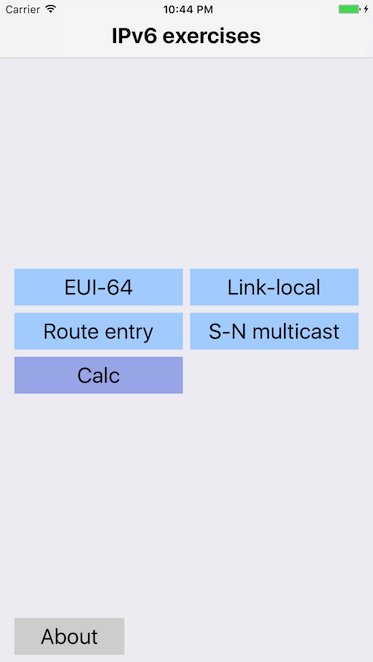
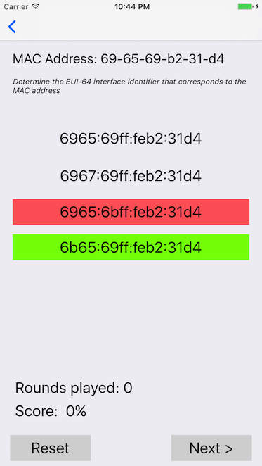
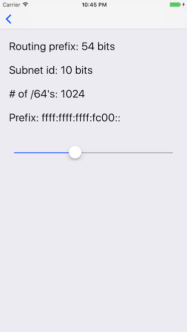

  
**About this app**

This app is created to be used for practicing IPv6 addressing. There are four quiz modes:  

*   EUI-64: given a MAC address determine which option is a valid EUI-64 interface identifier
*   Link-local: determine which option is a valid link local address
*   Route Entry: an IP address is given (e.g. 2001:5a37:ba63:1bc9::160) and the longest match route entry should be selected
*   S-N multicast: an IP address is given and the correct associated solicited-node multicast address should be selected

  

  
**Interface identifier**

IPv6 unicast and anycast addresses consist of two logical parts:

*   a 64-bit network prefix used for routing
*   a 64-bit interface identifier used to identify host

The interface identifier is often derived from the interface MAC address. A MAC address (48 bit) is turned into a 64-bit address (EUI-64) by a) inserting FF:FE in the middle and b) set the 7th bit from the left to 1. The 7th bit being set indicate that the interface identifier is globally unique. Example: the MAC address 01-02-03-04-05-06 becomes 0302:03FF:FE04:0506.  
  
  
**Link-local addresses**

A link-local address is required on every IPv6-enabled interface. Link-local addresses are only unique on the link.  
A link-local address is derived from:

*   Prefix field that contains the binary value 1111111010 (10 bits)
*   Zero bits (54 bits)
*   Interface identifier (64 bits)

This yield an effective format of fe80::/64.  
  

  
**Longest match shortest path**

When a router forward an IP packet it needs to find a route entry in its routing table to find the next hop information.  
The default criteria for the best route is simple:  

*   The route entry need to match the destination IP address of the packet
*   Of all matching route entries the longest match is preferred (longest prefix length)
*   Of all longest matches the shortest path is preferred (smallest metric)

  
  
**Solicited-node multicast address**
Solicited-node multicast addresses are used in Neighbor Discovery Protocol for obtaining the layer 2 link-layer addresses of other nodes. A solicited-node multicast address is an IPv6 multicast address valid within the local-link. The address is created by taking the last 24 bits of the host address and appending them to the prefix ff02::1:ff00:0/104.  
Example: Given a host with address 2001:5:6:7::1:2:3:4 the associated solicited-node multicast address is ff02::1:ff03:4.  
  

  
**Calculator**

A routing prefix size calculator is included in the app. IPv6 unicast and anycast addresses consist of two logical parts:

*   Network prefix
*   Interface identifier

The network prefix consist of a routing prefix (48-64 bits) and a subnet id (0-16 bits). This allow the network administrator to define subnets within the given network.  
The calculator also shows the number of /64 networks that are available in the given prefix.  
Move the slider to adjust the value.

    
